# TÀI LIỆU NGHIỆP VỤ HỆ THỐNG DIGITAL TRAVEL ERP
*(Hệ Thống Quản Trị Vận Hành & Quyết Toán Du Lịch Số)*

---

## 1. TỔNG QUAN HỆ THỐNG & KIẾN TRÚC MÃ NGUỒN

Digital Travel ERP là một hệ thống hoạch định tài nguyên doanh nghiệp (ERP) chuyên biệt cho ngành du lịch lữ hành. Hệ thống đồng bộ hóa toàn bộ quy trình từ khâu thiết kế sản phẩm mẫu, khởi hành tour thực tế, phân công hướng dẫn viên, đặt tour trực tuyến của khách hàng, vận hành thực tế tại hiện trường, quản lý chi phí phát sinh, cho đến quyết toán doanh thu - chi phí và tối ưu hóa lợi nhuận.

### Kiến Trúc Công Nghệ
- **Mô Hình Vận Hành:** Monorepo tích hợp chặt chẽ.
- **Backend:** Java 21, Spring Boot 4.0.5, Spring Security (bảo mật JWT/RBAC), Spring Data JPA (Hibernate ORM).
- **Database:** Oracle Database 19c/21c. Sử dụng triệt để sức mạnh của hệ quản trị cơ sở dữ liệu quan hệ với các ràng buộc cứng (`Constraints`), chỉ mục tối ưu hóa truy vấn (`Indexes`), các hàm (`Functions`), thủ tục (`Procedures`) và đặc biệt là hệ thống kích hoạt tự động (`Triggers`) để bảo đảm tính toàn vẹn tài chính và vận hành của ERP.
- **Frontend:** Gồm 3 ứng dụng khách độc lập xây dựng trên React 19, TypeScript và Vite, cùng kết nối đến hệ thống REST API qua proxy `/api`:
  1. `Frontend/Admin`: Giao diện dành cho các phòng ban nội bộ doanh nghiệp.
  2. `Frontend/HDV`: Giao diện tối ưu di động dành cho Hướng dẫn viên tác nghiệp tại hiện trường.
  3. `Frontend/Khachhang`: Cổng thông tin trực tuyến dành cho khách hàng tự phục vụ (Self-service portal).

---

## 2. BẢN ĐỒ PHÂN QUYỀN HỆ THỐNG (RBAC - ROLE-BASED ACCESS CONTROL)

Hệ thống bảo vệ các REST API bằng cơ chế Spring Security kết hợp với Token JWT. Toàn bộ nghiệp vụ được chia nhỏ và phân quyền nghiêm ngặt theo 7 vai trò (Roles) tương ứng với các phòng ban chức năng:

| Vai Trò | Mã Quyền | Chức Năng Nghiệp Vụ Chính | Giao Diện Sử Dụng |
| :--- | :--- | :--- | :--- |
| **Admin** | `ADMIN` | Quản trị tài khoản toàn hệ thống, cấp quyền, cấu hình tham số bảo mật, tra cứu nhật ký hệ thống (`NHATKYHETHONG`). | Admin |
| **Sản Phẩm** | `SANPHAM` | Quản lý vòng đời sản phẩm: Thiết kế Tour mẫu (`TOURMAU`), lịch trình chi tiết (`LICHTRINHTOUR`), danh mục dịch vụ bổ sung (`DICHVUTHEM`), danh mục Hành động xanh (`HANHDONGXANH`). | Admin (Phân hệ sản phẩm) |
| **Điều Hành** | `DIEUHANH` | Lập lịch khởi hành thực tế (`TOURTHUCTE`), cấu hình dịch vụ và hành động xanh áp dụng cho chuyến đi, quản lý hồ sơ và đánh giá năng lực HDV (`NANGLUCNHANVIEN`), phân công HDV (`PHANCONGTOUR`). | Admin (Phân hệ điều hành) |
| **Kinh Doanh** | `KINHDOANH` | Tiếp nhận và đối soát đơn đặt tour (`DONDATTOUR`), quản lý ví voucher của khách (`KHUYENMAI_KH`), tiếp nhận và xử lý các yêu cầu hủy tour / hỗ trợ hoàn tiền (`YEUCAUHOTRO`) từ khách hàng. | Admin (Phân hệ kinh doanh) |
| **Kế Toán** | `KETOAN` | Kiểm soát tài chính: Kiểm duyệt chi phí hiện trường do HDV khai báo (`CHIPHITHUCTE`), đối soát và duyệt hoàn tiền thực tế cho khách qua ngân hàng, lập quyết toán tour (`QUYETTOAN`), khóa số liệu tài chính. | Admin (Phân hệ kế toán) |
| **Hướng Dẫn Viên** | `HDV` | Tiếp nhận phân công tour, điểm danh thành viên đoàn (`DIEMDANH`), xác minh hành động xanh của khách tại hiện trường (`HANHDONG`), báo cáo sự cố hiện trường (`NHATKYSUCO`), khai báo chi phí phát sinh thực tế. | Giao diện HDV chuyên biệt |
| **Khách Hàng** | `KHACHHANG` | Tra cứu tour, thực hiện đặt tour trực tuyến, quản lý hồ sơ số cá nhân ("Hộ chiếu số" - `HOCHIEUSO`), tích lũy điểm xanh, đổi điểm lấy voucher, gửi ticket hỗ trợ/hủy tour, viết đánh giá sau chuyến đi. | Giao diện Khách hàng |

---

## 3. KIẾN TRÚC DỮ LIỆU & QUAN HỆ THỰC THỂ (DATABASE SCHEMA)

Cơ sở dữ liệu Oracle của hệ thống gồm 35 bảng thực thể được thiết kế chuẩn hóa cao độ để đảm bảo hiệu năng và tính toàn vẹn dữ liệu:

```mermaid
erDiagram
    TAIKHOAN ||--|| HOCHIEUSO : "1-1 (KHACHHANG)"
    TAIKHOAN ||--|| NHANVIEN : "1-1 (Internal)"
    NHANVIEN ||--|o NANGLUCNHANVIEN : "1-1"
    
    TOURMAU ||--o{ LICHTRINHTOUR : "Định nghĩa"
    TOURMAU ||--o{ TOURTHUCTE : "Nhân bản"
    
    TOURTHUCTE ||--o{ DICHVU_TOURTHUCTE : "Áp dụng"
    DICHVUTHEM ||--o{ DICHVU_TOURTHUCTE : "Liên kết"
    TOURTHUCTE ||--o{ HDX_TOURTHUCTE : "Áp dụng"
    HANHDONGXANH ||--o{ HDX_TOURTHUCTE : "Liên kết"
    
    TOURTHUCTE ||--o{ DONDATTOUR : "Nhận chỗ"
    HOCHIEUSO ||--o{ DONDATTOUR : "Đặt"
    
    DONDATTOUR ||--o{ DSNGUOIDONGHANH : "Khai báo"
    DONDATTOUR ||--o{ CHITIETDATTOUR : "Gồm hành khách"
    DSNGUOIDONGHANH ||--o{ CHITIETDATTOUR : "Liên kết"
    HOCHIEUSO ||--o{ CHITIETDATTOUR : "Liên kết"
    
    DONDATTOUR ||--o{ CHITIETDICHVU : "Mua thêm"
    DICHVUTHEM ||--o{ CHITIETDICHVU : "Liên kết"
    
    DONDATTOUR ||--o{ GIAODICH : "Thanh toán"
    DONDATTOUR ||--o{ DATTOUR_UUDAI : "Áp dụng"
    VOUCHER ||--o{ DATTOUR_UUDAI : "Liên kết"
    
    HOCHIEUSO ||--o{ KHUYENMAI_KH : "Ví voucher"
    VOUCHER ||--o{ KHUYENMAI_KH : "Liên kết"
    
    TOURTHUCTE ||--o{ PHANCONGTOUR : "Phân công"
    NHANVIEN ||--o{ PHANCONGTOUR : "Nhận nhiệm vụ"
    
    TOURTHUCTE ||--o{ DIEMDANH : "Điểm danh đoàn"
    HOCHIEUSO ||--o{ DIEMDANH : "Khách hàng"
    DSNGUOIDONGHANH ||--o{ DIEMDANH : "Đồng hành"
    NHANVIEN ||--o{ DIEMDANH : "HDV thực hiện"
    
    TOURTHUCTE ||--o{ HANHDONG : "Tích điểm xanh"
    HOCHIEUSO ||--o{ HANHDONG : "Khách thực hiện"
    HANHDONGXANH ||--o{ HANHDONG : "Liên kết"
    NHANVIEN ||--o{ HANHDONG : "HDV xác minh"
    
    TOURTHUCTE ||--o{ NHATKYSUCO : "Ghi nhận sự cố"
    NHANVIEN ||--o{ NHATKYSUCO : "HDV báo cáo"
    
    TOURTHUCTE ||--o{ CHIPHITHUCTE : "Phát sinh hiện trường"
    NHANVIEN ||--o{ CHIPHITHUCTE : "HDV khai"
    
    TOURTHUCTE ||--|| QUYETTOAN : "1-1 Đối chiếu doanh thu - chi phí"
    NHANVIEN ||--o{ QUYETTOAN : "Kế toán thực hiện"
    
    HOCHIEUSO ||--o{ NHATKYDOIDIEM : "Đổi thưởng"
    VOUCHER ||--o{ NHATKYDOIDIEM : "Liên kết"
    
    DONDATTOUR ||--o{ YEUCAUHOTRO : "Liên kết"
    HOCHIEUSO ||--o{ YEUCAUHOTRO : "Gửi ticket"
```



### Các Thực Thể Nghiệp Vụ Cốt Lõi:
1. **HOCHIEUSO (Hồ sơ số khách hàng):** Lưu trữ thông tin y tế (`GhiChuYTe`), dị ứng (`DiUng`), phân hạng thành viên (`HangThanhVien`) và số tích lũy `DiemXanh` trung thành của khách hàng.
2. **TOURTHUCTE (Tour thực tế):** Thực thể trung tâm của quy trình vận hành. Lưu thông tin ngày khởi hành, giá bán hiện hành, số chỗ còn lại (`ChoConLai`), trạng thái tour (`CHO_KICH_HOAT`, `MO_BAN`, `DANG_DIEN_RA`, `KET_THUC`, `HUY`, `DA_QUYET_TOAN`).
3. **DONDATTOUR (Đơn đặt tour):** Ghi nhận tổng tiền sau giảm giá, trạng thái đơn (`CHO_XAC_NHAN`, `DA_XAC_NHAN`, `DA_HUY`, `HET_HAN_GIU_CHO`, `CHO_HUY`, `TU_CHOI_HOAN_TIEN`, `THANH_TOAN_THAT_BAI`), thời gian hết hạn giữ chỗ (`ThoiGianHetHan`), và danh sách mã hóa các Hành động xanh khách cam kết thực hiện.
4. **CHITIETDATTOUR (Hành khách trong đơn):** Phân rã hành khách cụ thể (bao gồm người đặt `HOCHIEUSO` hoặc người đồng hành `DSNGUOIDONGHANH`) để tính toán chính xác giá vé theo nhóm tuổi tại thời điểm khởi hành.
5. **CHIPHITHUCTE (Chi phí hiện trường):** Lưu các khoản chi do HDV chi trả tại hiện trường tour kèm theo hình ảnh hóa đơn, trạng thái duyệt tài chính (`CHO_DUYET`, `DA_DUYET`, `TU_CHOI`, `YEU_CAU_BO_SUNG`).
6. **QUYETTOAN (Quyết toán tour):** Bảng tổng hợp chốt doanh số và chi phí thực tế của mỗi tour sau khi kết thúc chuyến đi.

---

## 4. TÍNH TOÀN VẸN CỦA ERP BẰNG DATABASE FUNCTIONS & TRIGGERS

Hệ thống Digital Travel ERP được thiết kế theo tư duy "Database-first" đối với các nghiệp vụ mang tính sống còn, đảm bảo tính toàn vẹn và nhất quán dữ liệu tuyệt đối kể cả khi có can thiệp trực tiếp vào DB hoặc API bị lỗi logic.

### A. Hệ Thống Ràng Buộc Tự Động (Triggers)

*   **Bảo vệ vai trò tài khoản (`TRG_KT_VAITRO_HOCHIEUSO` & `TRG_KT_VAITRO_NHANVIEN`):** Khóa cứng cơ sở dữ liệu, đảm bảo bảng hồ sơ số `HOCHIEUSO` chỉ được liên kết đến tài khoản có vai trò là `KHACHHANG`, và bảng `NHANVIEN` tuyệt đối không liên kết đến tài khoản khách hàng. Ngăn chặn việc chuyển đổi vai trò tài khoản khi đã có liên kết nghiệp vụ (`TRG_CHAN_DOI_VAITRO_TK`).
*   **Điều kiện mở bán Tour (`TRG_TTT_OPEN_REQUIRE_HDV`):** Chặn không cho phép chuyển trạng thái Tour thực tế sang `MO_BAN` nếu chưa có ít nhất một Hướng dẫn viên được phân công chấp nhận yêu cầu công tác (`TrangThaiChapNhan = 'DA_DONG_Y'`).
*   **Khóa biên lợi nhuận sàn (`TRG_KT_GIA_TOUR_THUCTE`):** Bảo vệ biên lợi nhuận tối thiểu bằng cách ngăn chặn tạo hoặc cập nhật giá bán hiện hành (`GiaHienHanh`) của Tour thực tế thấp hơn giá sàn (`GiaSan`) đã được phòng sản phẩm quy định trên Tour mẫu.
*   **Chống trùng lịch công tác của HDV (`TRG_KT_TRUNG_LICH_HDV`):** Trigger dạng `COMPOUND` tự động quét chéo toàn bộ dữ liệu lịch trình phân công. Ngăn chặn tuyệt đối việc phân công một Hướng dẫn viên tham gia hai tour thực tế bị trùng ngày hoặc có khoảng cách thời gian kết thúc tour cũ và khởi hành tour mới ít hơn **12 giờ** (thời gian tối thiểu để HDV nghỉ ngơi và tái tạo sức lao động).
*   **Kiểm soát sức chứa và giữ chỗ (`TRG_KT_SUC_CHUA_DATTOUR` & `TRG_CAPNHAT_CHO_CONLAI`):** 
    - `TRG_KT_SUC_CHUA_DATTOUR` kiểm soát số lượng hành khách trong một đơn đặt tour không được vượt quá sức chứa tối đa của tour thực tế (`SoKhachToiDa`).
    - `TRG_CAPNHAT_CHO_CONLAI` tự động tính toán lại số chỗ còn lại (`ChoConLai`) của Tour thực tế bất cứ khi nào có thao tác thêm, cập nhật hành khách hoặc thay đổi trạng thái đơn đặt tour sang `CHO_XAC_NHAN` hoặc `DA_XAC_NHAN`.
*   **Khóa băng tài chính quyết toán (`TRG_KHOA_CP_QUYETTOAN` & `TRG_CHOT_TOUR_QUYETTOAN`):** 
    - `TRG_CHOT_TOUR_QUYETTOAN` tự động chuyển trạng thái Tour thực tế sang `DA_QUYET_TOAN` khi kế toán lập biên bản quyết toán.
    - `TRG_KHOA_CP_QUYETTOAN` đóng băng dữ liệu tài chính bằng cách ngăn chặn toàn bộ thao tác thêm, sửa, hoặc xóa trên bảng `CHIPHITHUCTE` nếu tour đã được kế toán lập quyết toán hoặc chốt trạng thái quyết toán.
*   **Quy chế đánh giá nghiêm ngặt (`TRG_KT_DANHGIA_SAU_TOUR`):** Ngăn chặn khách hàng gửi đánh giá nếu chưa hoàn thành tour thực tế đó (`LICHSUTOUR`), hoặc gửi đánh giá quá hạn **30 ngày** kể từ ngày tour kết thúc.
*   **Hủy đơn dây chuyền khi hủy tour (`TRG_HUY_DON_KHI_HUY_TOUR`):** Khi phòng Điều hành buộc phải hủy một Tour thực tế (`TrangThai = 'HUY'`), trigger tự động quét tất cả đơn đặt tour đang hoạt động (`CHO_XAC_NHAN`, `DA_XAC_NHAN`, `CHO_HUY`), chuyển chúng sang trạng thái `DA_HUY`, và tự động sinh ticket hỗ trợ `HOAN_TIEN` ở trạng thái `CHUA_XU_LY` gửi đến phòng Kinh doanh và Kế toán xử lý thủ tục hoàn tiền cho khách.
*   **Tự động cập nhật số liệu giao dịch (`TRG_XACNHAN_DON_THANHTOAN` & `TRG_TANG_LUOT_DUNG_VC`):**
    - `TRG_XACNHAN_DON_THANHTOAN` tự động chuyển trạng thái đơn hàng sang `DA_XAC_NHAN` ngay khi tổng số tiền của các giao dịch `THANH_TOAN` thành công bằng hoặc lớn hơn tổng số tiền của đơn hàng.
    - `TRG_TANG_LUOT_DUNG_VC` tự động tăng số lượt đã sử dụng (`SoLuotDaDung`) trong bảng `VOUCHER` khi áp dụng thành công.

### B. Các Hàm Tính Toán Nghiệp Vụ (Database Functions)

*   `FN_TINH_TIEN_UU_DAI`: Nhận vào mã Voucher và tổng tiền đơn hàng, tự động xác định loại ưu đãi (Phần trăm hoặc Số tiền), áp dụng giảm trừ và khống chế mức giảm tối đa (`MucGiamToiDa`) của voucher đó.
*   `FN_TINH_TONG_DOANH_THU`: Tính tổng số tiền từ các giao dịch thanh toán thành công của một tour.
*   `FN_TINH_TONG_CHI_PHI`: Tính tổng các khoản chi phí hiện trường của tour đã được kế toán duyệt (`DA_DUYET`).
*   `FN_TINH_LOI_NHUAN`: Trả về lợi nhuận ròng của tour (`DoanhThu - ChiPhi`).
*   `FN_TINH_PHI_HUY_TOUR`: Tính phí phạt hủy tour dựa trên chính sách bậc thang của công ty:
    - Hủy > 15 ngày trước ngày khởi hành: Phí hủy là **10%** giá trị đơn hàng (hoàn 90%).
    - Hủy từ 7 đến 15 ngày: Phí hủy là **30%** giá trị đơn hàng (hoàn 70%).
    - Hủy từ 3 đến 6 ngày: Phí hủy là **50%** giá trị đơn hàng (hoàn 50%).
    - Hủy dưới 3 ngày: Phí hủy là **100%** giá trị đơn hàng (không hoàn tiền).

---

## 5. CHI TIẾT CÁC LUỒNG NGHIỆP VỤ XUYÊN SUỐT (END-TO-END WORKFLOWS)

---

### NGHIỆP VỤ A: KHÁCH HÀNG & PHÒNG KINH DOANH (CUSTOMER JOURNEY & SALES)

```
[Khách Hàng]                                   [Hệ Thống]                                  [Sales / Kinh Doanh]
     |                                              |                                                |
     |--- 1. Tra cứu & Đặt Tour (Companion, HDX) -->|                                                |
     |                                              |--- 2. Tính giá vé, giảm 50% trẻ em (<=11) ---->|
     |                                              |--- 3. Khóa chỗ tạm thời, lập hạn giữ chỗ ------>|
     |                                              |                                                |
     |<-- 4. Nhận thông tin đơn & Chuyển khoản -----|                                                |
     |                                              |                                                |
     |--- 5. Thực hiện Chuyển khoản & Xác nhận ---->| (Giao dịch "CHO_THANH_TOAN", tiền tố "KHXN:")  |
     |                                              |                                                |
     |                                              |<-- 6. Xem danh sách đơn cần đối soát ----------|
     |                                              |                                                |
     |                                              |                                                |-- 7. Kiểm tra sao kê,
     |                                              |                                                |   bấm "XÁC NHẬN"
     |                                              |                                                |<-- hoặc "TỪ CHỐI"
     |                                              |                                                |
     |                                              |--- 8. Nếu xác nhận: -------------------------->|
     |                                              |       - Chuyển đơn sang "DA_XAC_NHAN"          |
     |                                              |       - Trừ chỗ trống thực tế của tour         |
     |                                              |       - Tạo "LichSuTour" cho hành khách        |
     |                                              |       - Kích hoạt ví voucher / điểm xanh       |
     |<-- 9. Nhận thông báo xác nhận thành công ----|                                                |
```

#### 1. Quy Trình Đặt Tour (`DatTourService`)
Khi khách hàng gửi yêu cầu đặt tour (`DatTourRequest`):
- **Phân loại & Tính giá vé:** Hệ thống xác định độ tuổi của người đặt và từng người đồng hành (`DSNGUOIDONGHANH`) tại ngày khởi hành của tour. Trẻ em từ **11 tuổi trở xuống** được tự động giảm giá **50% giá vé hiện hành** (`tinhGiaVeTheoNgaySinh`).
- **Phụ thu dịch vụ:** Cộng dồn chi phí của các dịch vụ bổ sung đã chọn (`DICHVUTHEM`) với công thức `ThanhTien = DonGia * SoLuong`.
- **Ghi nhận cam kết xanh:** Hệ thống ghi nhận danh sách các hành động xanh khách hàng đăng ký cam kết thực hiện để làm cơ sở tích điểm sau này. Mã hóa và lưu trữ chuỗi thông tin dưới dạng `MaHdx:SoLuong:DiemTaiThoiDiemDat`.
- **Giữ chỗ tạm thời:** Tạo đơn đặt tour ở trạng thái `CHO_XAC_NHAN`. Thời gian giữ chỗ (`ThoiGianHetHan`) được ấn định là **2 ngày** kể từ thời điểm đặt. Hệ thống lập tức trừ chỗ trống `ChoConLai` tạm thời của tour.

#### 2. Áp Dụng Voucher Giảm Giá
Trong quá trình đặt tour, khách hàng có thể áp dụng 01 mã voucher có sẵn trong ví voucher cá nhân (`KHUYENMAI_KH`). Hệ thống sẽ:
- Kiểm tra tính hợp lệ: Voucher phải ở trạng thái `SAN_SANG`, thời gian hiện tại nằm trong hạn sử dụng, và ví voucher của khách hàng có bản ghi ở trạng thái `CO_HIEU_LUC`.
- Tính số tiền giảm: Sử dụng hàm `FN_TINH_TIEN_UU_DAI` để tính toán. Nếu giảm theo phần trăm, số tiền giảm không được vượt quá `MucGiamToiDa` của voucher.
- Tạo liên kết giảm giá (`DATTOUR_UUDAI`), khấu trừ tổng tiền đơn hàng, chuyển trạng thái voucher trong ví của khách hàng sang `DA_SU_DUNG`, và tăng số lượt đã dùng của voucher gốc.

#### 3. Thanh Toán & Đối Soát Giao Dịch
- **Thanh toán trực tuyến (Mock):** Khách hàng thanh toán qua cổng thanh toán giả định. Nếu thành công, hệ thống gọi `PROC_XAC_NHAN_THANH_TOAN`, tạo giao dịch thành công và tự động chuyển đơn sang `DA_XAC_NHAN` nhờ trigger.
- **Thanh toán chuyển khoản thủ công (Offline):** 
  - Khách hàng thực hiện chuyển khoản ngân hàng ngoài hệ thống và bấm xác nhận trên app. Hệ thống tạo giao dịch ở trạng thái `CHO_THANH_TOAN` với mã ngân hàng được gán tiền tố `KHXN:` (Khách xác nhận).
  - Nhân viên Kinh doanh (`KINHDOANH`) kiểm tra tài khoản ngân hàng của doanh nghiệp. Nếu tiền đã nổi, Sales bấm **Xác nhận thanh toán** trên giao diện Admin.
  - Hệ thống cập nhật giao dịch sang `THANH_CONG`, chốt đơn sang `DA_XAC_NHAN`, chính thức trừ chỗ trống thực tế trên tour, và ghi nhận bản ghi `LICHSUTOUR` cho khách hàng và những người đồng hành có hồ sơ hộ chiếu số trên hệ thống để làm cơ sở tích lũy điểm xanh.
  - Nếu chuyển khoản không hợp lệ, Sales bấm **Từ chối thanh toán**, giao dịch chuyển sang `THAT_BAI`, đơn hàng chuyển sang `THANH_TOAN_THAT_BAI` để hoàn trả lại chỗ trống trên tour.

#### 4. Hủy Tour & Hoàn Tiền (`HuyTourService`)
- Khách hàng gửi yêu cầu hủy tour thông qua giao diện cá nhân tối thiểu **2 ngày** trước ngày khởi hành.
- Hệ thống tự động tính số ngày còn lại đến lúc khởi hành và xác định tỉ lệ được hoàn lại tiền dựa trên chính sách phạt hủy (`tinhTiLeHoan`).
- Hệ thống tạo ticket hỗ trợ phân loại `HUY_TOUR` lưu trữ chi tiết lý do, tỉ lệ hoàn và số tiền hoàn dự kiến, chuyển trạng thái đơn hàng sang `CHO_HUY`. Đồng thời, tự động tạo giao dịch hoàn tiền `HOAN_TIEN` ở trạng thái `CHO_THANH_TOAN` gửi đến Kế toán.
- Nhân viên Kinh doanh kiểm tra ticket. Nếu đồng ý, Sales duyệt yêu cầu hủy, ticket chuyển sang `DA_XU_LY`. Nếu phát hiện gian lận hoặc vi phạm điều khoản, Sales từ chối yêu cầu hủy, đơn hàng tự động quay lại trạng thái hoạt động bình thường `DA_XAC_NHAN`.

---

### NGHIỆP VỤ B: PHÒNG ĐIỀU HÀNH & HƯỚNG DẪN VIÊN (OPERATIONS & FIELD OPS)

```
[Điều Hành / Dispatcher]                      [Hệ Thống]                                  [Hướng Dẫn Viên]
           |                                       |                                             |
           |--- 1. Tạo Tour Thực Tế (TOURTHUCTE) ->|                                             |
           |    (Kiểm tra GiaHienHanh >= GiaSan)   |                                             |
           |                                       |                                             |
           |--- 2. Tìm kiếm & Phân công HDV ------>| (Kiểm tra năng lực & check trùng lịch)      |
           |                                       |                                             |
           |                                       |<-- 3. Nhận thông báo yêu cầu công tác ------|
           |                                       |                                             |
           |                                       |                                             |-- 4. Bấm "ĐỒNG Ý"
           |                                       |<--------------------------------------------|
           |                                       |
           |--- 5. Chuyển trạng thái sang MO_BAN ->| (Trigger TRG_TTT_OPEN_REQUIRE_HDV kiểm tra)
           |                                       |
           |=========================== DIỄN RA TOUR HIỆN TRƯỜNG ================================|
           |                                       |
           |                                       |<-- 6. Điểm danh đoàn (Từng chặng hành trình)|
           |                                       |<-- 7. Xác minh Hành động xanh (Cộng điểm) --|
           |                                       |<-- 8. Báo cáo sự cố (Nếu SOS -> Alert) -----|
           |                                       |<-- 9. Khai báo chi phí hiện trường (Ảnh hóa đơn)
```

#### 1. Khởi Tạo & Phân Công Lịch Trình (`PhanCongTourService`)
- Phòng Điều hành (`DIEUHANH`) thiết lập chuyến đi thực tế dựa trên tour mẫu, quy định ngày đi, giá bán, sức chứa đoàn.
- **Phân công công tác:** Hệ thống lọc danh sách HDV đáp ứng năng lực ngôn ngữ, chuyên môn, và thực hiện đối chiếu lịch trình. Trigger `TRG_KT_TRUNG_LICH_HDV` sẽ ngăn chặn phân công nếu HDV bị trùng lịch hoặc khoảng nghỉ giữa 2 tour ít hơn 12 giờ.
- **Tiếp nhận phân công:** Yêu cầu phân công được gửi đến HDV ở trạng thái `CHO_PHAN_HOI`. HDV kiểm tra lịch trình chi tiết từng ngày (`LichTrinh`) và bấm Chấp nhận.
- **Kích hoạt mở bán:** Khi HDV chấp nhận phân công, trạng thái tour thực tế đủ điều kiện chuyển từ `CHO_KICH_HOAT` sang `MO_BAN` để Kinh doanh nhận khách.

#### 2. Tác Nghiệp Hiện Trường Của Hướng Dẫn Viên (`VanHanhService`)
Trong suốt thời gian tour diễn ra (`TrangThai = 'DANG_DIEN_RA'`), HDV sử dụng giao diện di động thực hiện các tác vụ:
- **Điểm Danh Đoàn (`diemDanh`):** HDV xem danh sách đoàn, ghi nhận các lưu ý đặc biệt về sức khỏe, bệnh lý, dị ứng của hành khách. Tại mỗi điểm tham quan hoặc chặng di chuyển, HDV thực hiện điểm danh từng thành viên (bao gồm cả khách chính và người đồng hành), cập nhật trạng thái: *Đã điểm danh*, *Chưa điểm danh*, hoặc *Vắng*.
- **Xác Minh Hành Động Xanh (`ghiNhanHanhDong`):** 
  - Khi khách hàng thực hiện các hành động bảo vệ môi trường thực tế (như hạn chế rác thải nhựa, dọn rác bãi biển, tiết kiệm năng lượng), HDV chụp ảnh minh chứng và bấm xác nhận trên ứng dụng.
  - Hệ thống lập tức cộng điểm xanh tích lũy cho khách hàng theo định mức của hành động xanh đó.
  - Hệ thống tự động kiểm tra tổng điểm tích lũy của khách hàng để tiến hành nâng hạng thành viên ngay lập tức nếu vượt ngưỡng: **Đồng** (>= 500 điểm), **Bạc** (>= 1000 điểm), **Vàng** (>= 2000 điểm), **Kim cương** (>= 5000 điểm).
- **Báo Báo Sự Cố Hiện Trường (`baoCaoSuCo`):** 
  - Nếu xảy ra sự cố tại hiện trường (Y tế, Thời tiết, Phương tiện, Ăn uống...), HDV lập báo cáo trên app kèm mô tả chi tiết, giải pháp tình thế, chỉ định khách hàng liên quan và phân loại mức độ nguy hiểm (`THAP` hoặc `SOS`).
  - Nếu sự cố được phân loại mức độ nguy hiểm là **SOS**, hệ thống lập tức kích hoạt cảnh báo khẩn cấp (Push alert) gửi đến phòng Điều hành và Ban quản lý để xin chỉ đạo trực tiếp và điều động cứu hộ nếu cần.

---

### NGHIỆP VỤ C: PHÒNG KẾ TOÁN & TÀI CHÍNH (FINANCE & RECONCILIATION)

```
[Hướng Dẫn Viên]                               [Hệ Thống]                                  [Kế Toán / Finance]
       |                                            |                                               |
       |--- 1. Gửi ảnh hóa đơn & Khai chi phí ----->|                                               |
       |                                            |--- 2. Chạy CẢNH BÁO ĐỘNG (Audit): ----------->|
       |                                            |      - Thiếu ảnh chứng từ (THIEU_CHUNG_TU)    |
       |                                            |      - Vượt định mức danh mục (VUOT_DINH_MUC) |
       |                                            |      - Giá cao bất thường (BAT_THUONG)        |
       |                                            |                                               |
       |                                            |<-- 3. Duyệt / Từ chối / Yêu cầu bổ sung ------|
       |                                            |                                               |
       |<-- 4. Nhận yêu cầu và cập nhật lại --------|                                               |
       |                                            |                                               |
       |=================================== QUYẾT TOÁN CUỐI TOUR ===================================|
       |                                            |                                               |
       |                                            |<-- 5. Xem trước lợi nhuận dự kiến ------------|
       |                                            |                                               |
       |                                            |<-- 6. Tạo quyết toán nháp (CHUA_QUYET_TOAN) --|
       |                                            |                                               |
       |                                            |<-- 7. Gửi ghi chú hỏi giải trình [Marker] ----|
       |                                            |                                               |
       |--- 8. Phản hồi giải trình [Marker] ------->|                                               |
       |                                            |                                               |
       |                                            |<-- 9. Số liệu khớp, bấm "CHỐT QUYẾT TOÁN" ----|
       |                                            |--- 10. Tour chuyển sang "DA_QUYET_TOAN"       |
       |                                            |--- 11. Trigger đóng băng toàn bộ chi phí       |
```

#### 1. Kiểm Soát Chi Phí Hiện Trường & Cơ Chế Cảnh Báo Động (Dynamic Auditing)
Để giảm thiểu tối đa thất thoát tài chính và gian lận hóa đơn, hệ thống ERP tích hợp bộ lọc kiểm toán tự động ngay khi HDV gửi yêu cầu thanh toán chi phí phát sinh (`KhaiChiPhiRequest`):
- **Kiểm tra chứng từ:** Hệ thống tự động gán nhãn cảnh báo `THIEU_CHUNG_TU` (mức độ CAO) nếu chi phí được khai báo không đính kèm liên kết ảnh hóa đơn thực tế.
- **Kiểm tra định mức danh mục (`VUOT_DINH_MUC`):** Đối chiếu số tiền khai báo với định mức trần quy định cho từng hạng mục chi phí của công ty:
  *   *Khách sạn / Lưu trú:* Tối đa 4,000,000 VND / giao dịch.
  *   *Ăn uống đoàn:* Tối đa 2,000,000 VND / giao dịch.
  *   *Phương tiện di chuyển:* Tối đa 3,000,000 VND / giao dịch.
  *   *Vé tham quan:* Tối đa 1,500,000 VND / giao dịch.
  Nếu vượt định mức, hệ thống tự động gán nhãn `VUOT_DINH_MUC` kèm theo đánh giá mức độ nghiêm trọng dựa trên tỷ lệ vượt ngưỡng: Vượt trên 50% gán nhãn `NGHIEM_TRONG`, vượt từ 30-50% gán nhãn `CAO`, vượt từ 10-30% gán nhãn `TRUNG_BINH`.
- **Cảnh báo bất thường thị trường (`BAT_THUONG_THI_TRUONG`):** So sánh giá trị khai báo với đơn giá thị trường thực tế của hạng mục chi phí tại địa phương đó. Nếu phát hiện cao hơn **1.5 lần**, hệ thống tự động cảnh báo nghi vấn nâng khống hóa đơn.
- **Tác vụ của Kế toán:** 
  - Kế toán duyệt danh sách cảnh báo chi phí động trên Dashboard Admin. 
  - Nếu chi phí hợp lệ, bấm **Duyệt (`DA_DUYET`)**. 
  - Nếu không đồng ý, bấm **Từ chối (`TU_CHOI`)**. 
  - Nếu cần làm rõ hoặc bổ sung chứng từ, bấm **Yêu cầu bổ sung (`YEU_CAU_BO_SUNG`)**. Yêu cầu này sẽ được gửi trực tiếp về app của HDV để cập nhật lại thông tin và gửi duyệt lại.

#### 2. Xử Lý Hoàn Tiền Thực Tế
- Đối với các giao dịch hoàn tiền `HOAN_TIEN` đang ở trạng thái `CHO_THANH_TOAN` (sinh ra từ việc hủy tour hợp lệ ở Phân hệ Kinh doanh):
- Kế toán tiến hành chuyển khoản hoàn tiền thực tế cho khách qua tài khoản ngân hàng.
- Sau khi giao dịch ngân hàng thành công, Kế toán bấm **Xác nhận hoàn tiền** trên hệ thống. 
- Hệ thống cập nhật giao dịch hoàn tiền sang `DA_HOAN_TIEN`, chuyển trạng thái đơn đặt tour sang `DA_HUY`, tự động cộng trả lại số chỗ trống `ChoConLai` thực tế của tour, và cập nhật ticket hỗ trợ hủy tour ban đầu sang `DA_XU_LY`.
- Nếu phát hiện thông tin tài khoản thụ hưởng sai lệch hoặc giao dịch hủy tour bị đình chỉ, Kế toán bấm **Từ chối hoàn tiền**, giao dịch chuyển sang `THAT_BAI`, đơn đặt tour chuyển sang `TU_CHOI_HOAN_TIEN` để bộ phận điều hành xử lý tranh chấp.

#### 3. Nghiệp Vụ Quyết Toán Tour (`QuyetToanService`)
Biên bản quyết toán là thủ tục tài chính bắt buộc để đóng một tour khởi hành thực tế.
- **Xem trước số liệu (`tinhToan`):** Khi chuyến đi kết thúc (`TrangThai = 'KET_THUC'`), Kế toán bấm Xem trước quyết toán. Hệ thống tự động chạy các hàm tổng hợp dữ liệu thời gian thực:
  *   `TongDoanhThu`: Tính tổng số tiền thực thu từ tất cả đơn hàng có trạng thái hợp lệ trên chuyến đi (`DA_XAC_NHAN`, `CHO_HUY`, `TU_CHOI_HOAN_TIEN`).
  *   `TongChiPhi`: Tính tổng toàn bộ chi phí hiện trường đã được Kế toán duyệt (`DA_DUYET`).
  *   `LoiNhuan`: Được tính bằng `TongDoanhThu - TongChiPhi`.
- **Tạo bản nháp quyết toán:** Kế toán tạo bản ghi quyết toán ở trạng thái nháp `CHUA_QUYET_TOAN`.
- **Trao đổi giải trình quyết toán:** 
  - Nếu số liệu chi phí thực tế có sự chênh lệch lớn so với dự toán, Kế toán gửi yêu cầu giải trình cho HDV bằng cách chèn nội dung ghi chú kèm marker định dạng đặc biệt: `[Yêu cầu bổ sung quyết toán...]`.
  - Trên app của mình, HDV sẽ nhìn thấy yêu cầu quyết toán bị treo cảnh báo. HDV tiến hành nhập nội dung giải trình bổ sung kèm ảnh chứng từ và bấm gửi phản hồi. Hệ thống tự động ghi nhận nội dung kèm marker định dạng ngược: `[HDV bổ sung quyết toán...]` để Kế toán nhận diện.
- **Chốt quyết toán:** Khi số liệu tài chính đã hoàn toàn chuẩn xác, Kế toán bấm **Chốt quyết toán**. 
- Hệ thống cập nhật trạng thái quyết toán sang `DA_QUYET_TOAN`. 
- Kích hoạt trigger `TRG_CHOT_TOUR_QUYETTOAN` chuyển trạng thái Tour thực tế sang `DA_QUYET_TOAN`.
- Kích hoạt trigger `TRG_KHOA_CP_QUYETTOAN` khóa băng toàn bộ cơ sở dữ liệu chi phí của tour. Ngăn chặn tuyệt đối mọi hành vi sửa đổi, thêm mới hoặc xóa dữ liệu tài chính sau khi tour đã quyết toán.

---

### NGHIỆP VỤ D: HỆ THỐNG TỰ ĐỘNG HÓA HỆ THỐNG (SCHEDULERS)

Hệ thống ERP triển khai các tác vụ chạy ngầm tự động (Cron jobs) để đảm bảo hệ thống vận hành trơn tru mà không cần con người thao tác thủ công:

1.  **Tự Động Hủy Giữ Chỗ Quá Hạn (`DatTourScheduler`):**
    - Chạy định kỳ để quét cơ sở dữ liệu của bảng `DONDATTOUR`.
    - Tìm kiếm các đơn hàng ở trạng thái `CHO_XAC_NHAN` có thời gian giữ chỗ thực tế vượt quá thời hạn `ThoiGianHetHan` mà chưa thực hiện thanh toán thành công hoặc chưa được Sales duyệt.
    - Hệ thống tự động chuyển trạng thái đơn sang `HET_HAN_GIU_CHO`, giải phóng số chỗ giữ chỗ tạm thời trả lại cho tour thực tế (`ChoConLai`).
2.  **Tự Động Đồng Bộ Vòng Đời Tour (`TourThucTeScheduler`):**
    - Chạy ngầm để đồng bộ trạng thái của các `TOURTHUCTE` dựa trên thời gian thực:
      *   Quét các tour ở trạng thái `CHO_KICH_HOAT` đã được phân công HDV xác nhận để tự động chuyển sang `MO_BAN` khi đến thời điểm mở bán quy định.
      *   Tự động chuyển trạng thái tour từ `MO_BAN` sang `DANG_DIEN_RA` vào đúng ngày khởi hành của tour (`NgayKhoiHanh`).
      *   Tự động quét ngày kết thúc tour (Ngày khởi hành + Thời lượng tour mẫu) để chuyển trạng thái tour từ `DANG_DIEN_RA` sang `KET_THUC`, sẵn sàng cho phòng Kế toán lập quyết toán doanh thu.

---

## 6. BẢN ĐỒ TƯƠNG THÍCH MÃ NGUỒN FRONTEND

Hệ thống Frontend gồm 3 ứng dụng được cấu hình định tuyến và giao diện khớp chính xác từng dòng mã nghiệp vụ của Backend:

### A. Frontend Khách Hàng (`Frontend/Khachhang/src/pages`)

*   **TrangChu.tsx (Cổng tra cứu):** Gọi API `GET /api/public/tour` để hiển thị danh sách tour thực tế đang mở bán (`MO_BAN`). Tích hợp bộ lọc tìm kiếm theo điểm đến, ngày khởi hành và giá cả.
*   **ChiTietTour.tsx (Trang đặt tour & tính toán):** 
    - Hiển thị chi tiết mô tả, đánh giá sao trung bình của tour mẫu (`DanhGia`), lịch trình chi tiết từng ngày (`LICHTRINHTOUR`).
    - Giao diện đặt tour cho phép nhập danh sách người đồng hành, tự động kiểm tra ngày sinh để hiển thị thông tin giảm giá 50% nếu là trẻ em.
    - Tích hợp chọn dịch vụ phụ thu bổ sung và tích chọn các hành động xanh cam kết thực hiện.
    - Cho phép khách hàng áp dụng voucher từ ví voucher cá nhân để xem trước số tiền giảm trừ trực quan trước khi xác nhận đặt tour.
    - Tích hợp cổng thanh toán giả lập (Mock payment QR).
*   **HoChieuSo.tsx (Hộ chiếu số & Loyalty Dashboard):**
    - **Personal Dashboard:** Hiển thị thông tin y tế (`GhiChuYTe`), dị ứng thực phẩm (`DiUng`) để khách hàng chủ động cập nhật trước chuyến đi.
    - **Loyalty Center:** Hiển thị mức hạng thành viên hiện tại (Đồng, Bạc, Vàng, Kim Cương), số điểm xanh tích lũy hiện có. Tích hợp giao diện đổi điểm xanh sang voucher thông qua API `POST /api/khachhang/doi-diem`.
    - **Ví Voucher:** Hiển thị danh sách voucher đang sở hữu và trạng thái sử dụng.
    - **Lịch sử chuyến đi:** Danh sách các tour đã đi, hỗ trợ bấm viết đánh giá xếp sao (`DANHGIAKH`) đối với các tour vừa kết thúc.
    - **Cổng Hỗ Trợ:** Giao diện gửi ticket yêu cầu hỗ trợ hoặc yêu cầu hủy tour hoàn tiền (`YEUCAUHOTRO`), theo dõi tiến độ xử lý ticket của phòng Kinh doanh và Kế toán.

### B. Frontend Hướng Dẫn Viên (`Frontend/HDV/src/pages`)

*   **BangDieuKhien.tsx (Dashboard HDV):** Hiển thị danh sách tour được phân công công tác trong tháng, tóm tắt lịch trình di chuyển tiếp theo, và hiển thị cảnh báo từ phòng Kế toán nếu có quyết toán cần giải trình bổ sung.
*   **DiemDanh.tsx (Tác nghiệp điểm danh):** Hiển thị danh sách thành viên đoàn thực tế của tour đang diễn ra. Cho phép HDV chọn điểm điểm danh và tích nhanh trạng thái (Đã điểm danh, Vắng) cho từng hành khách.
*   **DiemXanh.tsx (Xác minh hành động xanh):** Danh sách hành khách cam kết thực hiện hành động xanh trong tour. HDV tích chọn xác nhận hoàn thành, chụp ảnh minh chứng thực tế và tải lên hệ thống để cộng điểm xanh trực tiếp cho khách.
*   **BaoCaoSuCo.tsx (Báo cáo sự cố):** Form tạo báo cáo sự cố hiện trường. Cho phép HDV mô tả sự cố, nhập giải pháp tạm thời, chọn mức độ cảnh báo (`SOS` để đẩy cảnh báo khẩn cấp lên Admin) và chỉ định khách hàng liên đới chịu ảnh hưởng.
*   **QuanLyChiPhi.tsx (Quyết toán chi phí hiện trường):** 
    - Giao diện cho phép HDV tạo phiếu yêu cầu thanh toán chi phí phát sinh hiện trường. HDV nhập danh mục chi, số tiền, và sử dụng camera di động chụp ảnh hóa đơn đính kèm gửi duyệt.
    - Theo dõi trạng thái phê duyệt của Kế toán. Nếu phiếu chi bị gán nhãn `YEU_CAU_BO_SUNG`, HDV thực hiện sửa đổi số liệu hoặc chụp lại ảnh hóa đơn rõ nét hơn để gửi duyệt lại.

### C. Frontend Quản Trị Admin (`Frontend/Admin/src/pages`)

Giao diện Admin được chia thành các phân hệ nghiệp vụ nghiêm ngặt, tự động hiển thị menu chức năng dựa trên vai trò tài khoản đăng nhập:

*   **tour-template / services / green-actions (Dành cho vai trò `SANPHAM`):** Giao diện thiết kế tour mẫu, cập nhật lịch trình chi tiết, quản lý danh mục giá dịch vụ phụ thu và cấu hình điểm thưởng hành động xanh.
*   **tour-instance / dispatch / guide (Dành cho vai trò `DIEUHANH`):** Giao diện khởi tạo tour thực tế, phân công HDV công tác (hệ thống tự động lọc HDV không bị trùng lịch), và đánh giá chấm điểm năng lực HDV dựa trên phản hồi của khách hàng.
*   **orders / customers / promotions / complaints (Dành cho vai trò `KINHDOANH`):** 
    - Giao diện đối soát danh sách đơn đặt tour chờ thanh toán ngân hàng (Sales kiểm duyệt các giao dịch chuyển khoản offline có mã `KHXN:`).
    - Quản lý hồ sơ khách hàng, phát hành chương trình khuyến mãi / Voucher mới.
    - Xử lý các yêu cầu hủy tour hoàn tiền và ticket khiếu nại của khách hàng.
*   **finance (Dành cho vai trò `KETOAN`):** 
    - Bảng điều khiển kiểm duyệt chi phí hiện trường do HDV gửi về (Tích hợp cột hiển thị tự động nhãn cảnh báo tài chính thông minh: *Thiếu chứng từ*, *Vượt định mức*, *Bất thường thị trường*).
    - Danh sách xử lý giao dịch hoàn tiền thực tế cho khách qua ngân hàng.
    - Giao diện Quyết toán tour: Tổng hợp tự động doanh thu thực tế, chi phí thực tế đã duyệt để tính toán lợi nhuận ròng của chuyến đi. Tích hợp cổng chốt quyết toán để đóng băng dữ liệu tài chính vĩnh viễn.
*   **system (Dành cho vai trò `ADMIN`):** Quản lý danh sách tài khoản nhân viên nội bộ hệ thống, phân quyền vai trò phòng ban, và tra cứu nhật ký thao tác nghiệp vụ hệ thống (`NHATKYHETHONG`).
